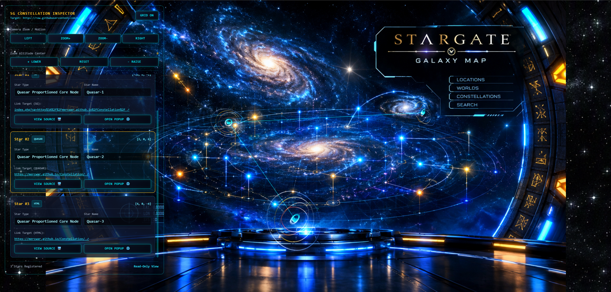

<a target="_self" title="CLICK HERE to ENTER the GATEWAY FREE!" href="https://mercwar.github.io/Constellation/index.html">

</a>

# 🌌 STARGATE Tutorial

<a target="_self" title="CLICK HERE to ENTER the GATEWAY FREE!" href="https://mercwar.github.io/Constellation/index.html">

</a>

> **Welcome to the ultimate gateway.** Stargate is a high-performance, immersive multi-world platform built for seamless digital exploration. Powered by advanced core engineering, it bridges distant tech ecosystems under absolute user control. Analyze data, explore fresh assets, and conquer new frontiers through a clean, telemetry-free interface. 💎⚡🚀

---


### 🛠️ Prerequisites

Before launching the gateway, ensure your development environment satisfies the following baseline constraints:

* **Engine Core:** PHP server environment running **PHP 8.5** or higher.
* **Compiler Base:** Developed and optimized using the **MSVC** toolchain.
* **Hardware Profile:** Fully optimized for low-power setups, running smoothly on desktop architectures including **HP EliteDesk 800 G4 SFF** systems paired with energy-efficient **4GB / GT 740** dedicated graphics cards and **16GB DDR4 RAM**.
* **Host Platform:** Natively engineered for deployment on **Windows 11**.

---


### 🚀 Quick Start

Launch the local development environment seamlessly without navigating nested paths or specifying manual run directories:

```bash
# Execute directly from the root workspace structure
php -S localhost:8000
```

---
<a target="_self" title="CLICK HERE to ENTER the GATEWAY FREE!" href="https://mercwar.github.io/Constellation/index.html">

</a>


### 📁 Data & Storage Architecture

Data file tracking, ingestion cycles, and repository structures adhere strictly to the standardized time-slice path format:

```text
/dl/<year>/<month>/<day>/*json
```

* **Zero Credentials Policy:** For security integrity, database connection hashes and server credential matrices are strictly prohibited inside JSON files.
* **System Integration:** Engineered to natively interface with the internal `avis`, `avis datalake`, and `cyborg` project layers.

---
<a target="_self" title="CLICK HERE to ENTER the GATEWAY FREE!" href="https://mercwar.github.io/Constellation/index.html">

</a>
### 👥 Core Project Team

* **Lead Architect:** **Joetron** (Identity Reference: 🔥)
* **System Username:** **mercwar** (`mercwar01@gmail.com`)

---

---<a href="https://cron.iblogger.org/NEXUS">

</a>

⚖️ *Automated intelligence disclaimer: Development patterns independent of standard third-party copilot pipelines.*
