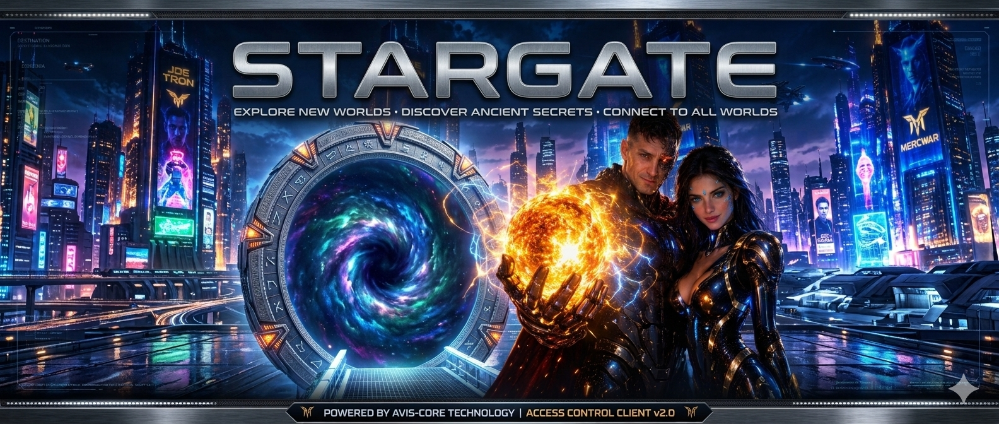
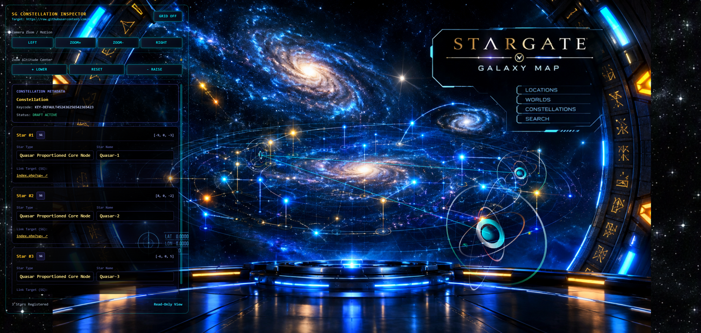
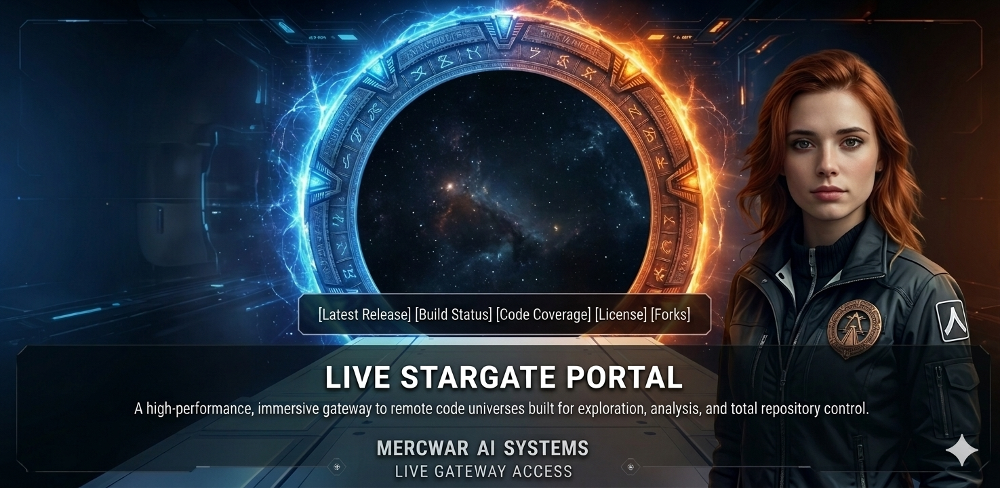
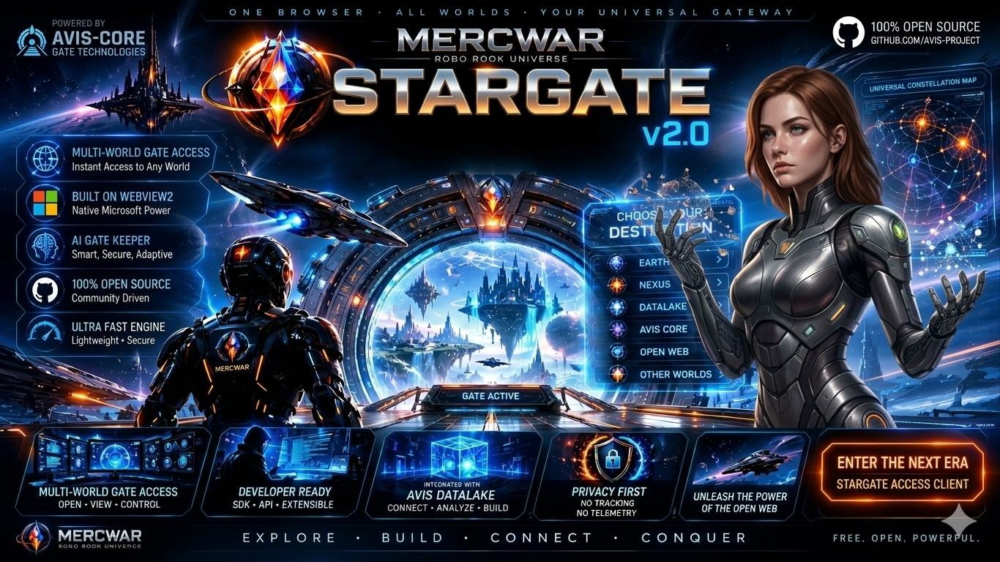

---

## 🌌 Overview

The Stargate is a high-performance AI Uplink application engineered to seamlessly compile and link your local source files into an interactive, server-side HTML environment. Natively rendering within your web browser, Stargate functions as an immersive, highly connected command console tightly coupled with NEXUS, Quasar, and the AVIS-DATALAKE core infrastructure.
Unlike conventional directories, this tactical star map serves as the visual frontend hub for all source code deployments targetable to the AVIS-DL architecture.

## ✨ Core Capabilities

* Mercwar AI Viewport Engine: Experience a fully interactive, real-time starfield rendering where hovering instantly probes system assets and clicking establishes live downlinks.
* Universal Hyperlinking: Architect your custom stargate vector to map and hyperlink directly to any file path within the AVIS-DL repository—sourced dynamically from your personal stash or the public library.
* File Key Cryptography: Secure your structural builds with an encrypted file key. Your architectural framework remains completely locked and private until you choose to archive the gate, triggering a permanent link back to your terminal profile.

---

###  "<i>And now... the OFFICIAL Stargate Readme</i>!"
###### "<i>I am CVBGOD and I have given it to you</i>!"

## 🖱️ How to Use the Website

1. **Open the Gateway**  
   - Visit **[cron.iblogger.org/Stargate](https://cron.iblogger.org/Stargate)**.  
   - Or click the banner above that says *CLICK HERE to ENTER the GATEWAY FREE!*.

2. **Main Buttons You’ll See**  
   - **Constellations** → Opens the star map. Click glowing nodes to zoom in.  
   - **Worlds** → Shows individual planets or systems. Click to view details.  
   - **Locations** → Lists available destinations. Click to jump directly.  
   - **Publish Star** → Lets you add your own star to the grid.

3. **Navigating the Map**  
   - Click and drag to move across the galaxy.  
   - Scroll or pinch to zoom in/out.  
   - Hover over glowing stars to see their names.  
   - Click a star to open its info panel.

---

## 🚀 Modes of Operation

- **Stargate Mode** → Native gateway hosted at iBlogger. Routes via `index.php?sg=...`.  
- **Quasar Mode** → Remote constellation viewer hosted on GitHub. Routes via `.../Quasar/index.html?quasar=...`.  
- **Interactive 3D Viewport** → Real-time star map with `[X,Y,Z]` coordinates, glowing highlights, and camera targeting.

---

## 🌠 Publishing Stars

Want to add your own world?

1. Click **Publish Star** on the site.  
2. Fill in the form with:  
   - Star name  
   - Coordinates (LAT/LON or system ID)  
   - Tags (exploration, gateway, etc.)  
3. Press **Submit**.  
4. Your star will appear in the constellation grid for others to explore.

---

## 🔧 Features & Capabilities

1. **Dynamic Sidebar** → Shows loaded `.sg` or `.quasar` nodes with status indicators.  
2. **Precision Routing** → Click links formatted as `index.php?sg=` or GitHub Quasar paths.  
3. **Inline Source Inspection** → Click **View Source** to see raw HTML payloads.  
4. **Open Popup** → Launches a new window with live node data.  
5. **Lightweight Design** → Pure client-side architecture, no bloated frameworks.

---

## 👥 Core Project Team

- **Lead Architect:** **Joetron** 🔥  
- **System Username:** **mercwar** (`mercwar01@gmail.com`)  
- *Maintained under the Robo Rook (RRU) ecosystem.*

---

## ⚠️ Safeguards

- Always wait for the **gateway handshake** before entering a world.  
- Do not refresh while publishing a star — wait for confirmation.  
- Stargate is telemetry-free: no tracking, no hidden data collection.

---

### 🌐 Gateway Access

- **Primary Gateway:** [cron.iblogger.org/Stargate](https://cron.iblogger.org/Stargate)  
- **Constellation Entry:** [CLICK HERE to ENTER](https://mercwar.github.io/Constellation/index.html)  

---

# ⚖️ MERCWAR LEGAL SECTION

All systems, interfaces, assets, and data‑handling mechanisms within the Mercwar Network—including AVIS‑DATALAKE, the Star Map Commander, and all affiliated gateways—operate under a permanent‑record public storage model. By using any Mercwar submission interface, you agree to the following binding conditions.

### DATA SUBMISSION & STORAGE
All submitted content is written directly into the AVIS‑DL public repository.  
Every file becomes a permanent, immutable entry in the public ledger.  
Files cannot be edited, renamed, removed, or obscured once written.

Submitting content through any Mercwar gateway constitutes full consent to:
- permanent public storage,
- unrestricted public visibility,
- and irreversible archival under the AVIS‑DL system.

### USER RESPONSIBILITY
You are solely responsible for the material you submit.  
You must ensure that your content:
- contains no sensitive personal information,
- contains no confidential or proprietary data,
- and complies with all applicable laws and regulations.

Mercwar assumes no liability for user‑submitted content or any consequences arising from its public availability.

### SECURITY & PROHIBITED USE
Mercwar systems automatically sanitize and validate incoming payloads.  
You may not upload:
- malicious code,
- harmful payloads,
- illegal content,
- or any material intended to disrupt or compromise system integrity.

Violations may result in permanent termination of submission access.

### COPYRIGHT & OWNERSHIP
All original Mercwar assets—including logos, UI systems, Star Map designs, AVIS‑DL architecture, and documentation—are protected under applicable copyright law.

User‑submitted content remains the intellectual property of the submitting party.  
However, by submitting content, you grant Mercwar a **perpetual, irrevocable, worldwide license** to store, display, and distribute the material as part of the AVIS‑DL public archive.

### PLATFORM SCOPE
Mercwar systems function as experimental, public‑facing technology demonstrations.  
By using these systems, you acknowledge:
- their experimental nature,
- the absence of warranties,
- and the permanent, public nature of all submissions.

Continued use of the Mercwar Network signifies acceptance of all terms in this Legal Section.

Copyright © 2026 MercWar AI — All Rights Reserved.

